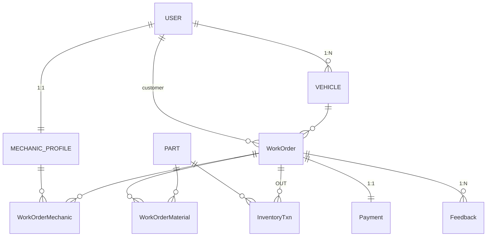

# 车辆维修管理系统 ER 设计

> 生成时间：2025-05-25 10:17:20

---

## Mermaid ER 图

---

## 实体定义

### USER
| 字段 | 类型 | 约束 | 说明 |
|---|---|---|---|
| user_id | BIGINT | PK | |
| role | ENUM('customer','mechanic','admin') | NOT NULL | |
| name | VARCHAR(60) | NOT NULL | |
| phone | CHAR(11) | UNIQUE | |
| email | VARCHAR(120) | UNIQUE | |
| password_hash | CHAR(60) |  | |
| created_at | DATETIME | default CURRENT_TIMESTAMP | |

### VEHICLE
| 字段 | 类型 | 约束 | 说明 |
|---|---|---|---|
| vehicle_id | BIGINT | PK | |
| user_id | BIGINT | FK → USER | |
| plate_no | VARCHAR | UNIQUE | |
| vin | VARCHAR |  | |
| model | VARCHAR |  | |
| year | SMALLINT |  | |

### MECHANIC_PROFILE
| 字段 | 类型 | 约束 | 说明 |
|---|---|---|---|
| mechanic_id | BIGINT | PK = user_id | |
| trade | ENUM('engine','paint','electric') |  | |
| hourly_rate | DECIMAL(6,2) |  | |
| hire_date | DATE |  | |
| cert_no | VARCHAR |  | |

### PART
| 字段 | 类型 | 约束 | 说明 |
|---|---|---|---|
| part_id | BIGINT | PK | |
| name | VARCHAR |  | |
| unit | ENUM('pcs','L','kg') |  | |
| unit_cost | DECIMAL(10,2) |  | |

### INVENTORY_TXN
| 字段 | 类型 | 约束 | 说明 |
|---|---|---|---|
| txn_id | BIGINT | PK | |
| part_id | BIGINT | FK → PART | |
| order_id | BIGINT | FK nullable → WorkOrder | 出库时用 |
| qty | INT | 正负数量 | |
| type | ENUM('IN','OUT','ADJUST') | | |
| created_at | DATETIME | default now | |

### WORKORDER
| 字段 | 类型 | 约束 | 说明 |
|---|---|---|---|
| order_id | BIGINT | PK | |
| vehicle_id | BIGINT | FK | |
| customer_id | BIGINT | FK → USER | |
| status | ENUM('pending','assigned','in_progress','done','cancel') | | |
| created_at | DATETIME | | |
| finished_at | DATETIME | | |
| description | TEXT | | |
| cancel_reason | TEXT | nullable | |

### WORKORDER_MECHANIC
| 字段 | 类型 | 约束 | 说明 |
|---|---|---|---|
| order_id | BIGINT | FK PK* | |
| mechanic_id | BIGINT | FK PK* | |
| hours_worked | DECIMAL(4,1) | | |
| status | ENUM('accepted','refused','completed') | | |
| note | TEXT | | |

### WORKORDER_MATERIAL
| 字段 | 类型 | 约束 | 说明 |
|---|---|---|---|
| order_id | BIGINT | FK PK* | |
| part_id | BIGINT | FK PK* | |
| qty | INT | | |
| price | DECIMAL(10,2) | | |

### PAYMENT
| 字段 | 类型 | 约束 | 说明 |
|---|---|---|---|
| payment_id | BIGINT | PK | |
| order_id | BIGINT | FK UNIQUE | |
| labor_fee | DECIMAL(10,2) | | |
| material_fee | DECIMAL(10,2) | | |
| total_fee | DECIMAL(10,2) | | |
| paid_at | DATETIME | nullable | |

### FEEDBACK
| 字段 | 类型 | 约束 | 说明 |
|---|---|---|---|
| feedback_id | BIGINT | PK | |
| order_id | BIGINT | FK | |
| user_id | BIGINT | FK | |
| type | ENUM('rating','urge') | | |
| rating | INT | nullable | |
| comment | TEXT | | |
| created_at | DATETIME | | |
